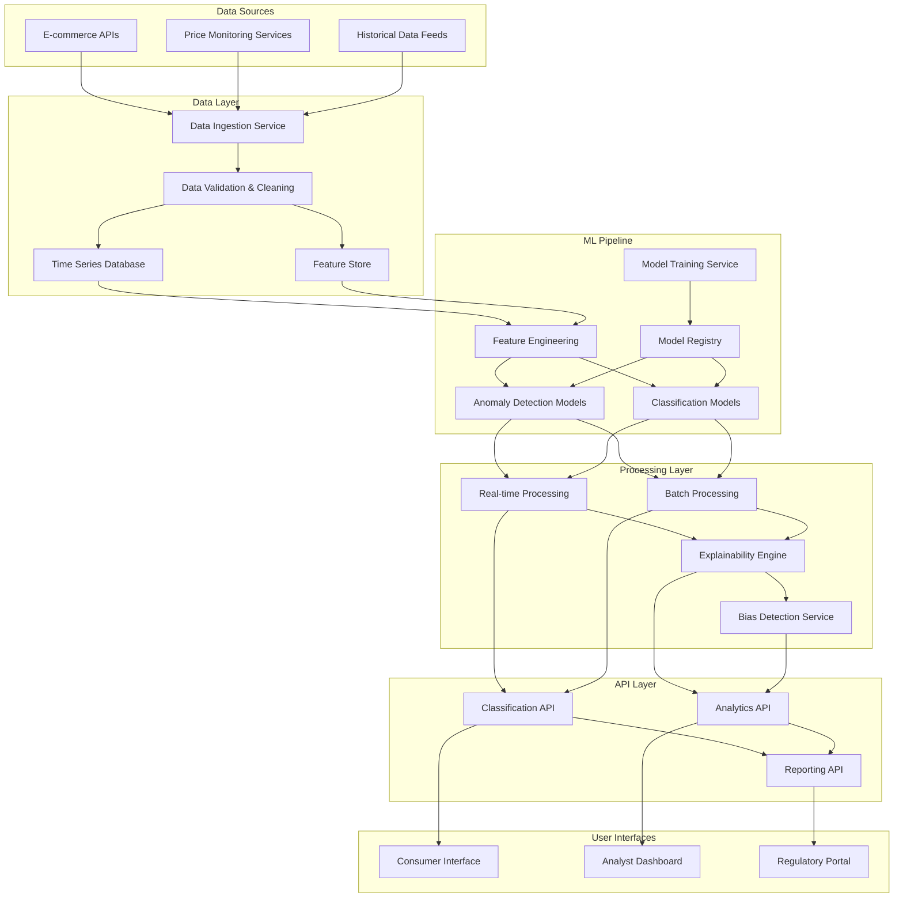

# Design Document: Fake Discount Detection System

## Overview

The Fake Discount Detection System is an AI-powered platform that analyzes e-commerce pricing patterns to identify misleading discount practices. The system combines time-series analysis, machine learning-based anomaly detection, and explainable AI techniques to classify discount authenticity and provide transparent insights to multiple stakeholder groups.

The system architecture follows a microservices approach with separate components for data ingestion, ML processing, classification, and user interfaces. Key design principles include scalability, explainability, ethical AI practices, and real-time processing capabilities.

## Architecture

### High-Level Architecture



### Technology Stack

- **Data Storage**: Apache Kafka (streaming), InfluxDB (time series), PostgreSQL (metadata)
- **ML Framework**: Python with scikit-learn, TensorFlow, and PyTorch
- **Real-time Processing**: Apache Flink
- **Batch Processing**: Apache Spark
- **API Framework**: FastAPI with async support
- **Containerization**: Docker with Kubernetes orchestration
- **Monitoring**: Prometheus and Grafana
- **Explainability**: SHAP, LIME, and custom time-series explanation methods

## Components and Interfaces

### Data Ingestion Service

**Purpose**: Collect and normalize pricing data from multiple e-commerce platforms

**Key Functions**:
- API integration with major e-commerce platforms
- Data validation and quality checks
- Rate limiting and error handling
- Data normalization across different formats

**Interface**:
```python
class DataIngestionService:
    def ingest_price_data(self, source: str, data: PriceData) -> ValidationResult
    def validate_data_quality(self, data: PriceData) -> QualityScore
    def normalize_price_format(self, raw_data: Dict) -> PriceData
```

### Feature Engineering Service

**Purpose**: Extract relevant features for ML models from raw price data

**Key Functions**:
- Time-series feature extraction (trends, seasonality, volatility)
- Price pattern analysis (sudden spikes, gradual increases)
- Sale event detection and correlation
- Statistical feature computation (percentiles, moving averages)

**Interface**:
```python
class FeatureEngineeringService:
    def extract_time_series_features(self, price_history: List[PricePoint]) -> TimeSeriesFeatures
    def detect_price_patterns(self, price_history: List[PricePoint]) -> PatternFeatures
    def calculate_baseline_price(self, price_history: List[PricePoint]) -> BaselinePrice
    def identify_sale_events(self, price_history: List[PricePoint]) -> List[SaleEvent]
```

### Anomaly Detection Engine

**Purpose**: Identify unusual pricing patterns using multiple ML techniques

**Key Functions**:
- Isolation Forest for outlier detection
- LSTM-based time series anomaly detection
- Statistical process control methods
- Ensemble anomaly scoring

**Interface**:
```python
class AnomalyDetectionEngine:
    def detect_price_anomalies(self, features: TimeSeriesFeatures) -> AnomalyScore
    def train_anomaly_models(self, training_data: List[PriceHistory]) -> ModelMetrics
    def update_models_incremental(self, new_data: List[PriceHistory]) -> UpdateResult
```

### Classification Service

**Purpose**: Classify discounts as genuine, suspicious, or fake based on anomaly scores and patterns

**Key Functions**:
- Multi-class classification using ensemble methods
- Confidence score calculation
- Threshold-based decision making
- Model performance monitoring

**Interface**:
```python
class ClassificationService:
    def classify_discount(self, features: DiscountFeatures) -> ClassificationResult
    def calculate_confidence_score(self, features: DiscountFeatures) -> float
    def update_classification_thresholds(self, performance_metrics: ModelMetrics) -> None
```

### Explainability Engine

**Purpose**: Generate human-readable explanations for classification decisions

**Key Functions**:
- SHAP-based feature importance for time series
- Natural language explanation generation
- Visualization of price patterns and anomalies
- Counterfactual explanation generation

**Interface**:
```python
class ExplainabilityEngine:
    def generate_explanation(self, classification: ClassificationResult) -> ExplanationReport
    def create_price_visualization(self, price_history: List[PricePoint]) -> Visualization
    def generate_natural_language_summary(self, explanation: ExplanationReport) -> str
```

## Data Models

### Core Data Structures

```python
@dataclass
class PricePoint:
    product_id: str
    price: Decimal
    mrp: Decimal
    discount_percentage: float
    timestamp: datetime
    platform: str
    sale_event: Optional[str]

@dataclass
class PriceHistory:
    product_id: str
    price_points: List[PricePoint]
    baseline_price: Decimal
    price_volatility: float
    trend_direction: str

@dataclass
class TimeSeriesFeatures:
    trend_slope: float
    seasonality_strength: float
    volatility_score: float
    spike_frequency: int
    pre_sale_inflation: float
    price_stability_index: float

@dataclass
class ClassificationResult:
    discount_class: str  # 'genuine', 'suspicious', 'fake'
    confidence_score: float
    anomaly_score: float
    explanation_summary: str
    supporting_evidence: List[str]

@dataclass
class ExplanationReport:
    classification: str
    confidence: float
    key_factors: List[str]
    price_pattern_analysis: str
    historical_comparison: str
    risk_indicators: List[str]
    visualization_data: Dict
```

### Database Schema

**Price History Table**:
- product_id (VARCHAR, PRIMARY KEY)
- platform (VARCHAR)
- price_history (JSONB)
- baseline_price (DECIMAL)
- last_updated (TIMESTAMP)

**Classification Results Table**:
- classification_id (UUID, PRIMARY KEY)
- product_id (VARCHAR, FOREIGN KEY)
- classification (VARCHAR)
- confidence_score (FLOAT)
- anomaly_score (FLOAT)
- explanation (JSONB)
- created_at (TIMESTAMP)

**Model Performance Table**:
- model_id (UUID, PRIMARY KEY)
- model_type (VARCHAR)
- version (VARCHAR)
- accuracy_metrics (JSONB)
- training_date (TIMESTAMP)
- status (VARCHAR)

## Correctness Properties

*A property is a characteristic or behavior that should hold true across all valid executions of a system—essentially, a formal statement about what the system should do. Properties serve as the bridge between human-readable specifications and machine-verifiable correctness guarantees.*

Before defining the correctness properties, I need to analyze the acceptance criteria from the requirements to determine which ones are testable as properties.

### Property 1: Historical Price Analysis Accuracy
*For any* product with 12+ months of price history, the system should correctly identify price trends and calculate baseline prices using the median of 90-day periods excluding sale events.
**Validates: Requirements 1.1, 1.3, 1.4**

### Property 2: Pre-Sale Price Inflation Detection
*For any* price history containing price increases 1-4 weeks before sale events, the system should detect these patterns and flag them appropriately.
**Validates: Requirements 1.2**

### Property 3: Score Normalization Consistency
*For any* analysis result, all generated scores (anomaly scores, confidence scores) should fall within the range 0.0 to 1.0 inclusive.
**Validates: Requirements 2.3, 3.5**

### Property 4: Discount Classification Completeness
*For any* discount evaluation, the system should classify it as exactly one of: genuine, suspicious, or fake, based on the defined business rules (fake if >30% inflation within 30 days, suspicious for moderate indicators, genuine otherwise).
**Validates: Requirements 3.1, 3.2, 3.3, 3.4**

### Property 5: ML Model Application Consistency
*For any* price data analysis, the system should apply trained machine learning models and generate anomaly scores using time-series analysis algorithms.
**Validates: Requirements 2.1, 2.2**

### Property 6: Explainability Report Generation
*For any* discount classified as suspicious or fake, the system should generate an explainability report containing specific manipulation patterns, historical price data, and statistical measures.
**Validates: Requirements 4.1, 4.2, 4.3, 4.5**

### Property 7: Fairness and Bias Prevention
*For any* set of retailers or products with similar characteristics, the system should apply consistent evaluation criteria regardless of retailer size, product category, or brand, avoiding discriminatory bias.
**Validates: Requirements 5.1, 5.3**

### Property 8: Audit Trail Completeness
*For any* classification decision made by the system, a complete audit log entry should be created containing the decision, reasoning, and relevant metadata.
**Validates: Requirements 5.5**

### Property 9: User Interface Adaptation
*For any* user role (shopper, analyst, regulator), the system should provide appropriate interface complexity and information detail matching their needs and expertise level.
**Validates: Requirements 6.1, 6.2, 6.3**

### Property 10: Performance Under Load
*For any* system load scenario, response times should remain within specified limits (3 seconds for real-time queries, 5 seconds under scaling, 1 hour for batch processing).
**Validates: Requirements 6.4, 7.2, 8.5**

### Property 11: Data Integrity Maintenance
*For any* incoming data, the system should validate quality, handle corrupted records appropriately, normalize formats, and eliminate duplicates while maintaining data integrity.
**Validates: Requirements 8.2, 8.3, 8.4**

### Property 12: Model Training and Evaluation Rigor
*For any* model training process, the system should use proper cross-validation splits (80/20 minimum) and calculate comprehensive performance metrics (precision, recall, F1-score) for each classification category.
**Validates: Requirements 9.1, 9.2**

### Property 13: Incremental Learning Capability
*For any* new training data or model performance degradation, the system should update models incrementally and trigger retraining when accuracy drops below 80%.
**Validates: Requirements 2.4, 9.3, 9.4**

### Property 14: Compliance and Reporting Completeness
*For any* regulatory request or compliance requirement, the system should generate reports in standard formats (PDF, CSV, JSON) with statistical summaries and ensure data retention complies with Indian data protection laws.
**Validates: Requirements 10.1, 10.2, 10.3, 10.5**

### Property 15: Privacy Protection Implementation
*For any* personal or sensitive commercial data processed, the system should implement appropriate anonymization techniques and privacy protection measures.
**Validates: Requirements 5.2, 10.4**

## Error Handling

### Data Quality Issues
- **Missing Price Data**: Implement interpolation strategies for short gaps, flag products with excessive missing data
- **Corrupted Records**: Validate data format and ranges, quarantine invalid records for manual review
- **API Failures**: Implement exponential backoff retry logic, maintain service degradation gracefully

### Model Performance Degradation
- **Accuracy Drops**: Automatic retraining triggers when performance falls below thresholds
- **Concept Drift**: Monitor data distribution changes and adapt models accordingly
- **Bias Detection**: Continuous monitoring for algorithmic bias with automated alerts

### System Failures
- **Service Outages**: Circuit breaker patterns for external dependencies
- **Database Failures**: Read replicas and automated failover mechanisms
- **Resource Exhaustion**: Auto-scaling with resource limits and graceful degradation

### User Input Validation
- **Invalid Queries**: Input sanitization and validation with informative error messages
- **Authentication Failures**: Secure session management with appropriate access controls
- **Rate Limiting**: Prevent abuse with configurable rate limits per user type

## Testing Strategy

### Dual Testing Approach

The system requires both unit testing and property-based testing to ensure comprehensive coverage:

**Unit Tests** focus on:
- Specific examples of known fake discount patterns
- Edge cases in price calculation algorithms
- Integration points between microservices
- Error handling scenarios and boundary conditions
- API endpoint functionality and response formats

**Property-Based Tests** focus on:
- Universal properties that hold across all inputs
- Comprehensive input coverage through randomization
- Validation of business rules across diverse scenarios
- Performance characteristics under various load conditions

### Property-Based Testing Configuration

- **Testing Framework**: Use Hypothesis (Python) for property-based testing
- **Test Iterations**: Minimum 100 iterations per property test to ensure statistical significance
- **Test Tagging**: Each property test must reference its design document property
- **Tag Format**: **Feature: fake-discount-detection, Property {number}: {property_text}**

### Testing Categories

**ML Model Testing**:
- Property tests for model consistency and fairness
- Unit tests for specific classification scenarios
- Performance tests for throughput and latency requirements

**Data Processing Testing**:
- Property tests for data normalization and validation
- Unit tests for specific data corruption scenarios
- Integration tests for API data ingestion

**Business Logic Testing**:
- Property tests for discount classification rules
- Unit tests for specific discount calculation examples
- End-to-end tests for complete user workflows

**Security and Compliance Testing**:
- Property tests for privacy protection measures
- Unit tests for specific anonymization scenarios
- Compliance tests for regulatory requirement adherence

Each correctness property must be implemented by a single property-based test that validates the universal behavior across all valid inputs, ensuring the system maintains correctness at scale.